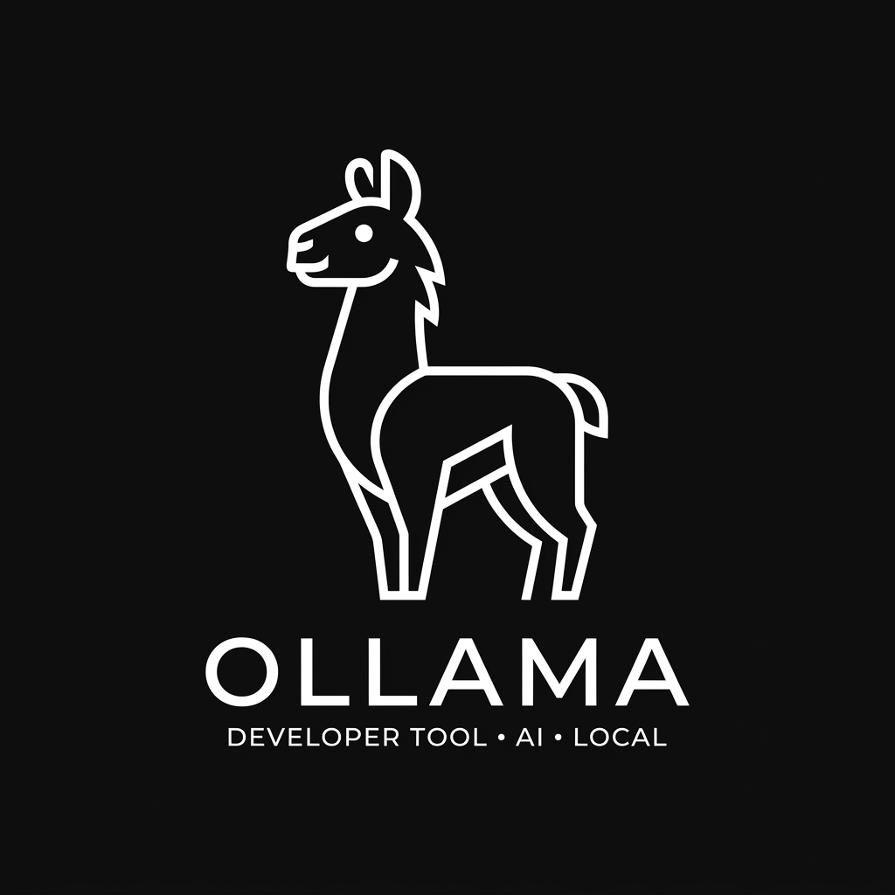

# Ollama GUI

  

Ollama GUI is a local AI workspace interface for running LLMs. It features isolated workspaces, custom directive scopes, action planning, visual execution board progress flows, and multi-file code attachments.

Disclaimer: This project is an independent, community-driven interface and is not affiliated with, sponsored by, or endorsed by the official Ollama project.

## Monorepo Layout

- **apps/desktop**: Tauri desktop wrapper client (React frontend + Rust native bindings).
- **apps/cli**: Standalone command-line interface companion in Rust.
- **libs/core**: Core engine libraries managing workspaces, memory, and directories context indexing.
- **libs/ollama-api**: Rust client wrapper client for local Ollama endpoints.
- **libs/plugins**: Modular runtime extension framework.

## Contributing

Please review CONTRIBUTING.md for coding guidelines, git workflow steps, and Conventional Commit instructions.
